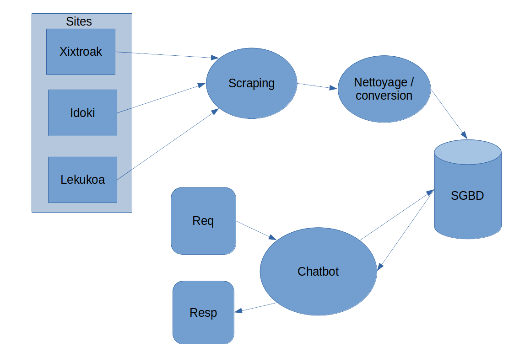
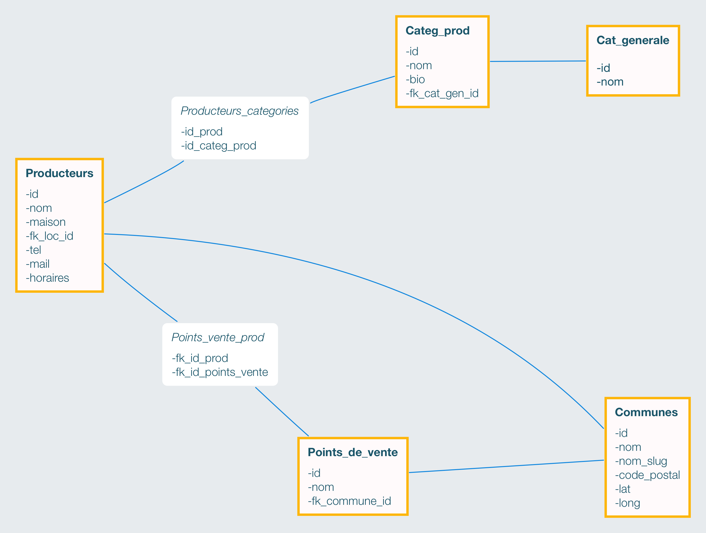

# EtxaldeBot

## Résumé: 
Chatbot qui s'adresse à des utilisateurs du Pays-Basque et qui souhaitent pouvoir rapidement chercher et trouver des produits fermiers aux alentours de chez eux.   
Le chatbot doit pouvoir leur indiquer où trouver les produits recherchés selon différents critères (localisation, produit bio ou pas, type de produit..)
Enfin, après analyse des produits recherchés par l'utilisateur, le chatbot doit pouvoir effectuer des recommandations pour d'autres produits.

## HOW TO
- DB: Créer une base de données MariaDB
	- nom: etxaldebot 
	- user: root 
	- password: root
	- port 3306
	
- DUMP: Exécuter la commande dans le terminal:   
```mysql -u root -p etxaldebot < chemin_vers_dossier/projet-final-devdataia-Kesskisspass/dump/etxaldebot.sql```

- LAUNCH: Exécuter commande dans le terminal:   
```python chemin_vers_dossier/projet-final-devdataia-Kesskisspass/app.py```

- USE: Lancer un navigateur sur l'adresse locale: [http://127.0.0.1:5000/](http://127.0.0.1:5000/)

## Outils utilisés:
- Récupération des informations: scraping pour extraire les données de différents sites (BeautifulSoup)
- Stockage des données en BDD relationelle (MariaDB ou PostGreSQL)
- Création du chatbot: Python
- Pour effectuer les recommandations aux utilisateurs: utilisation d'un modèle de machine learning (Kmeans)

## Schéma Fonctionnement Général:


## Schéma Base de données
